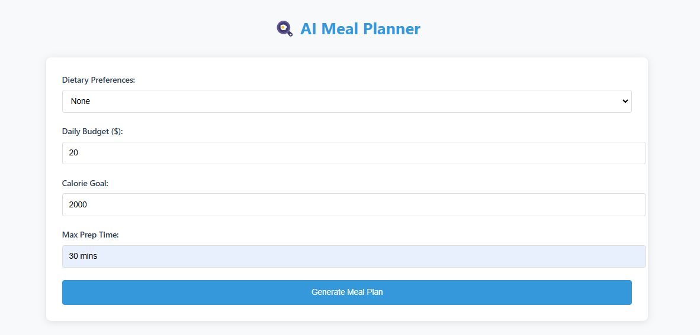
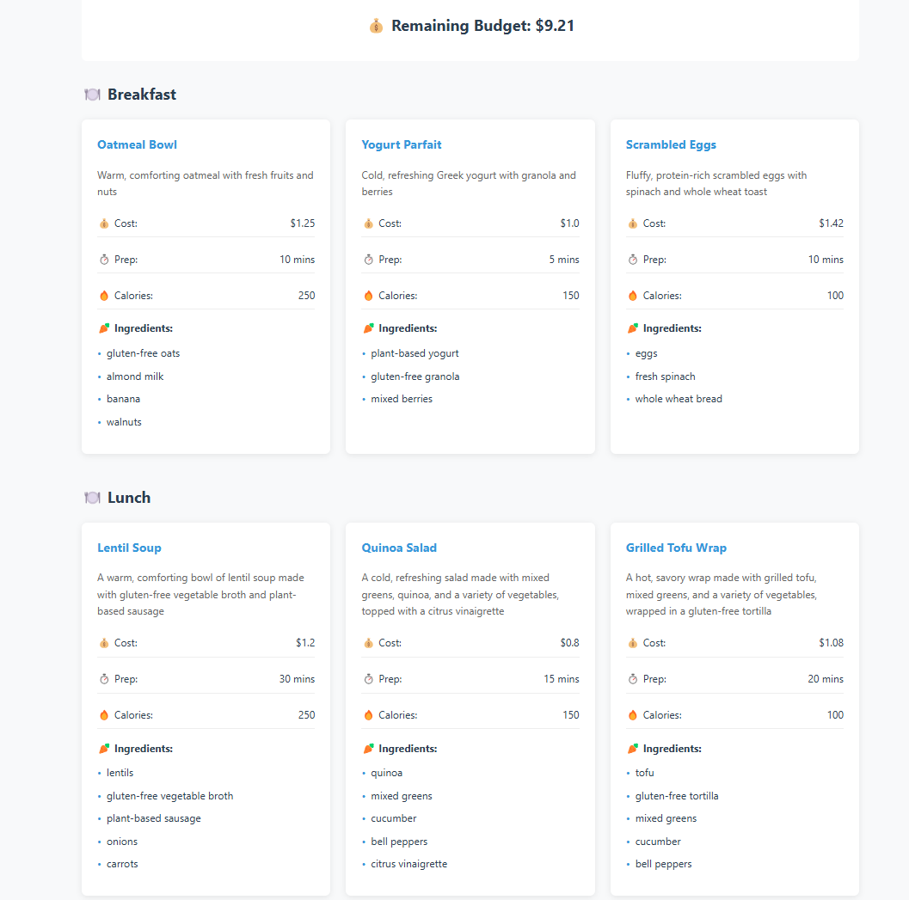
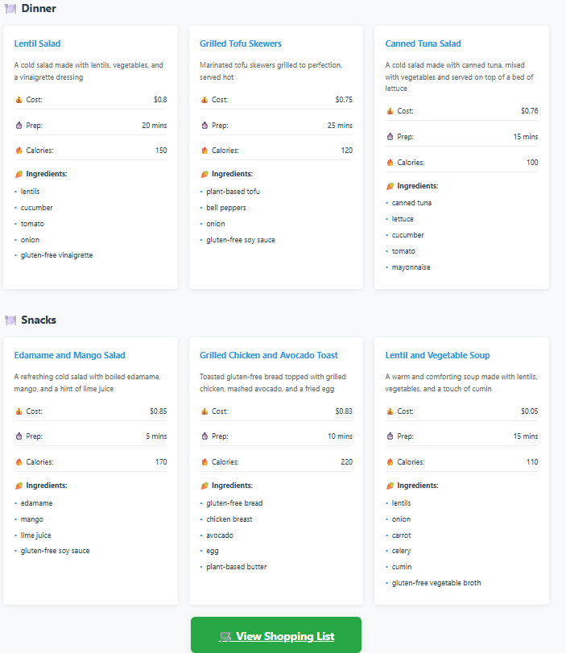
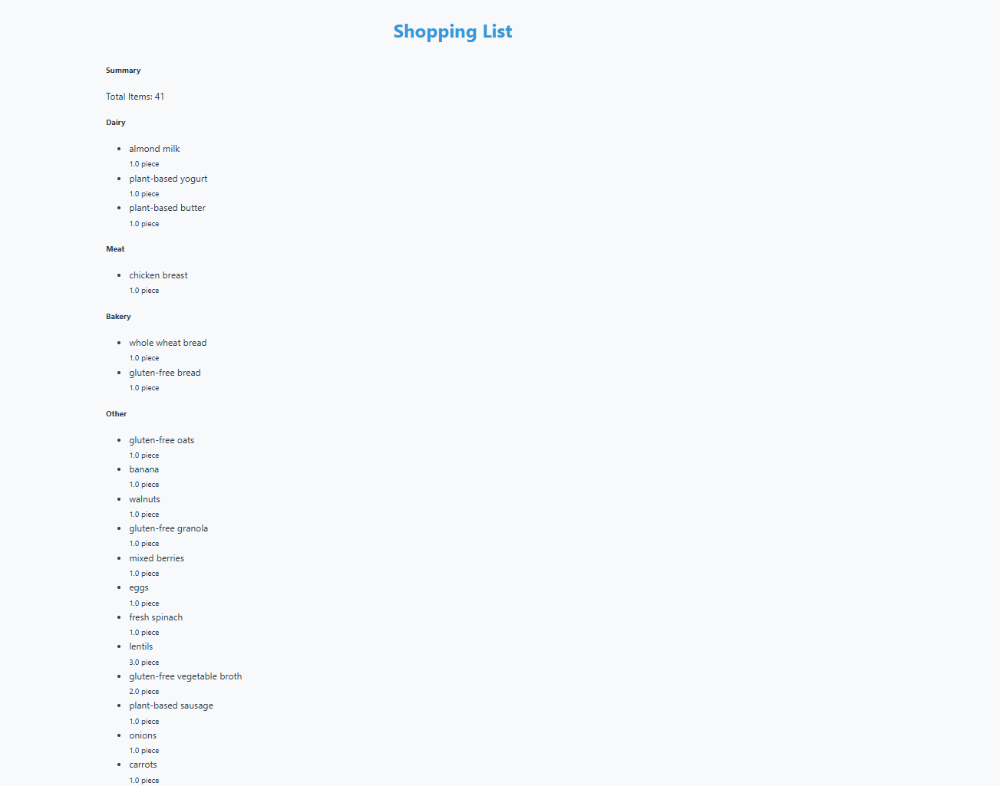

# Multi-Agent Meal Planning System

## Overview
The Multi-Agent Meal Planning System is a Flask-based application that generates meal plans based on **user dietary preferences, budget constraints, and calorie goals**. It utilizes multiple **AI-driven agents** to suggest meals while ensuring **budget and dietary compliance**.

## Features
✅ **AI-Powered Meal Planning** - Generates meal options dynamically  
✅ **Supports Multiple Diets** - Vegetarian, Vegan, Gluten-Free  
✅ **Budget Management** - Ensures meals fit within the budget  
✅ **Calorie Control** - Limits meals to user-specified calorie intake  
✅ **Error Handling & Auto-Retries** - Adjusts meals dynamically  
✅ **Multi-Meal Support** - Handles **breakfast, lunch, dinner, and snacks**
✅ **Shopping List Generation** - Instantly creates a consolidated shopping list for all planned meals

## User Interface Preview
### **Home Page**


### **Breakfast & Lunch Options**


### **Dinner & Snacks Options**


### **Shopping List**


## Project Structure
```
multi_agent_meal_planning/
│── agents/                 # AI Agents for meal generation
│   ├── breakfast_agent.py
│   ├── lunch_agent.py
│   ├── dinner_agent.py
│   ├── snack_agent.py
│   ├── budget_agent.py
│   ├── shopping_list_agent.py   # Agent for shopping list generation
│── tools/                   # Utility functions
│   ├── budget_checker.py
│── templates/               # HTML templates for Flask
│   ├── index.html
│   ├── shopping_list.html   # Shopping list page
│── static/                  # Frontend assets (CSS, JS, images)
│   ├── styles.css
│   ├── AI_meal_planner.png
│   ├── breakfast_lunch_options.png
│   ├── dinner_snack_options.png
│   ├── shopping_list.png    # Shopping list UI preview
│── config.py                # API & model configurations
│── app.py                   # Main Flask application
│── .env                     # Environment variables (API keys)
│── requirements.txt         # Python dependencies
│── .gitignore               # Git ignore rules
│── README.md                # Project documentation
```

## Installation
### 1️⃣ Clone the Repository
```sh
git clone https://github.com/yourusername/multi-agent-meal-planning.git
cd multi-agent-meal-planning
```

### 2️⃣ Set Up Virtual Environment (Optional but Recommended)
```sh
python -m venv venv
source venv/bin/activate   # On Mac/Linux
venv\Scripts\activate      # On Windows
```

### 3️⃣ Install Dependencies
```sh
pip install Flask openai autogen groq numpy pandas python-dotenv requests tqdm
```

### 4️⃣ Configure Environment Variables
Create a **.env** file and add:
```
GROQ_API_KEY=your_actual_api_key_here
```

### 5️⃣ Run the Application
```sh
python app.py
```
The app will be available at **http://127.0.0.1:5000**.

## Usage
1️⃣ **Select dietary preference** (vegetarian, vegan, gluten-free)  
2️⃣ **Set budget and calorie limit**  
3️⃣ **Submit the form**  
4️⃣ **View AI-generated meal plans**  
5️⃣ **Click 'View Shopping List' to see all required ingredients**  
6️⃣ **Print or export your shopping list as needed**  
7️⃣ **Adjust constraints if needed**  

## API Agents
- **🥞 BreakfastAgent** - Generates breakfast options
- **🍛 LunchAgent** - Suggests lunch meals
- **🍲 DinnerAgent** - Plans dinner
- **🍎 SnackAgent** - Provides snack suggestions
- **💰 BudgetAgent** - Ensures meals fit within the budget
- **🛒 ShoppingListAgent** - Generates a consolidated shopping list from meal plans

## Shopping List Feature
- After generating a meal plan, click the **"View Shopping List"** button below your results.
- The shopping list page displays all required ingredients, grouped by category, with quantities.
- You can print or export the list for easy grocery shopping.